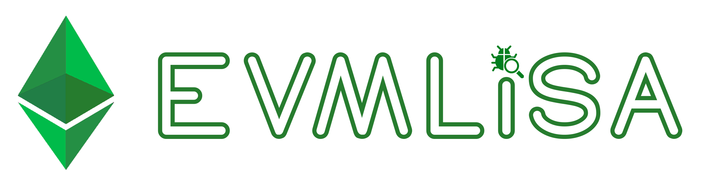

# EVMLiSA: an abstract interpretation-based static analyzer for EVM bytecode


EVMLiSA is a static analyzer based on abstract interpretation for [EVM bytecode](https://www.ethervm.io/) of smart contracts deployed on Ethereum blockchain and built upon [LiSA](https://unive-ssv.github.io/lisa/). Given a EVM bytecode smart contract, EVMLiSA builds a sound and precise control-flow graph of the smart contract.

EVMLiSA is based on the peer-reviewed publication
> Vincenzo Arceri, Saverio Mattia Merenda, Greta Dolcetti, Luca Negrini, Luca Olivieri, Enea Zaffanella. _**"Towards a Sound Construction of EVM Bytecode Control-Flow Graphs"**_. In Proceedings of the 26th ACM International Workshop on Formal Techniques for Java-like Programs (FTfJP 2024), co-located with ECOOP 2024.

# 🛠 Building EVMLiSA
Compiling EVMLiSA requires:
- JDK >= 11
- [Gradle](https://gradle.org/releases/) >= 6.6
- [Etherscan API key](https://etherscan.io/myapikey)

You need to:
- Clone the repository:
  ```bash
  git clone https://github.com/lisa-analyzer/evm-lisa.git
  cd evm-lisa
  ```
- Import the project into the Eclipse/IntelliJ workspace as a Gradle project (optional).

# ⚙️ Running EVMLiSA
Before running EVMLiSA, ensure you have set up an Environment Variable with your Etherscan API Key. Follow the steps below to set up the environment variable:

1. Begin by creating a file named `.env` in the EVMLiSA project.
2. Inside the `.env` file, add the following line:
```
ETHERSCAN_API_KEY=<your_etherscan_api_key>
```
3. Replace `<your_etherscan_api_key>` with your Etherscan API key.

> Here you can find how to generate an [Etherscan API key](https://etherscan.io/myapikey).

Once you have set up the environment variable, you can run EVMLiSA via Docker or via Bash.

## Via Docker
Build the container:
```
mkdir -p execution/docker &&
docker build -t evm-lisa:latest .
```

Then you can run EVMLiSA with:
```
docker run --rm -it \
-v $(pwd)/.env:/app/.env \
-v $(pwd)/execution/docker:/app/execution/results \
evm-lisa:latest \
-a <smart_contract_address> [options]
```

- `-v $(pwd)/.env:/app/.env`: mount the `.env` file.
- `-v $(pwd)/execution/docker:/app/execution/results`: share the results' folder.

> Replace `<smart_contract_address>` with the address of the Ethereum smart contract you want to analyze.

## Via Bash
Build the Project:
```bash
./gradlew build
```

Create Distribution Zip:
```bash
./gradlew distZip
```

Unzip the Distribution:
```bash
unzip build/distributions/evm-lisa.zip -d execution
```

Then you can run EVMLiSA with:
```bash
./execution/evm-lisa/bin/evm-lisa \
-a <smart_contract_address> [options]
```
> Replace `<smart_contract_address>` with the address of the Ethereum smart contract you want to analyze.

This command will initiate the analysis process for the specified smart contract, providing insights and results based on the EVM bytecode of the contract.

```
Options:
 -a,--address <arg>                        Address of an Ethereum smart contract.
 -b,--benchmark <arg>                      Filepath of the benchmark.
 -c,--cores <arg>                          Number of cores used in benchmark.
    --creation-code                        Parse bytecode as creation code (instead of runtime code).
    --dot                                  Export a dot-notation file.
    --download-bytecode                    Download the bytecode.
    --dump-report                          Dump analysis report.
    --dump-stats                           Dump statistics.
 -f,--filepath-bytecode <arg>              Filepath of the bytecode file.
    --html                                 Export a graphic HTML report.
    --link-unsound-jumps-to-all-jumpdest   Link all the unsound jumps to all jumpdest.
 -o,--output <arg>                         Output directory path.
    --reentrancy-checker                   Enable re-entrancy checker.
    --serialize-inputs                     Serialize inputs.
    --stack-set-size <arg>                 Dimension of stack-set (default: 8).
    --stack-size <arg>                     Dimension of stack (default: 32).
    --use-live-storage                     Use the live storage in SLOAD.
```

# 🔍 Abstract Stack Set Domain
In the analysis of EVM bytecode programs, EVMLiSA employs a domain of sets of abstract stacks to enhance precision, particularly when loops are encountered in the source code.

EVMLiSA introduces the abstract stack powerset domain $\texttt{SetSt}_{k,h,l}$ which consists of sets of abstract stacks with at most $l$ elements and an height of at most $h$. This domain allows the analyzer to maintain collections of abstract stacks, avoiding the need to compute the lub and allowing each element of an abstract stack to be a $k$ integer set.

# 📋 Running example
Here is an example of how to run EVMLiSA. In this example, we will analyze a smart contract at the address `0x7c21C4Bbd63D05Fa9F788e38d14e18FC52E9557B` with specific options for stack size, stack-set size, live storage usage and the dump of the CFG:

- Bash:
```bash
./execution/evm-lisa/bin/evm-lisa \
-a 0x7c21C4Bbd63D05Fa9F788e38d14e18FC52E9557B \
--stack-size 64 \
--stack-set-size 10 \
--dump-stats \
--use-live-storage
```

- Docker:
```bash
docker run --rm -it \
-v $(pwd)/.env:/app/.env \
-v $(pwd)/execution/docker:/app/execution/results \
evm-lisa:latest \
-a 0x7c21C4Bbd63D05Fa9F788e38d14e18FC52E9557B \
--stack-size 64 \
--stack-set-size 10 \
--dump-stats \
--use-live-storage
```

> Use `docker run -a stderr` to dump only the json report as standard output.

The expected output is as follows:
```yaml
##############
Total opcodes: 344
Total jumps: 45
Resolved jumps: 44
Definitely unreachable jumps: 1
Maybe unreachable jumps: 0
Unsound jumps: 0
Maybe unsound jumps: 0
##############
```

### Jump classification
- _Resolved_: all the destinations of the jump node have been resolved;
- _Definitely unreachable_: the jump node is unreachable (i.e., it is reached with the bottom abstract state);
- _Maybe unreachable_: the jump node is not reachable in the CFG, starting from its entry point, but it may be reachable via a (maybe) unsound jump node (if any);
- _Unsound_: the jump node is reached at least with a stack with an unknown numerical value that may correspond to a
valid jump destination as the top element;
- _Maybe unsound_: the stack set exceeded the maximal stack size.

---

## Contributors
<a href="https://github.com/lisa-analyzer/evm-lisa/graphs/contributors">
  
</a>